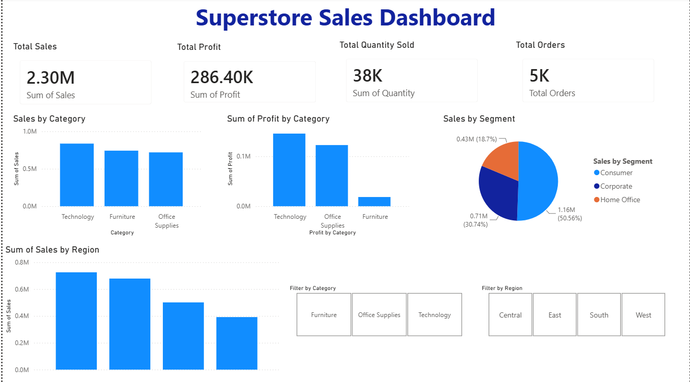
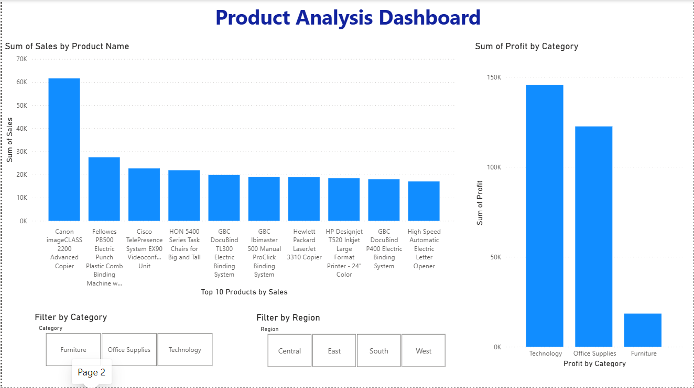

\# Superstore Sales Dashboard

\## About the Project

This is a Power BI dashboard created using the Sample Superstore dataset. The dashboard helps to understand sales performance, profit, quantity sold, and order details through different charts and KPIs.

\## Dashboard Features

\* Total Sales

\* Total Profit

\* Total Quantity Sold

\* Total Orders

\* Sales by Category

\* Profit by Category

\* Sales by Region

\* Sales by Segment

\* Product Analysis

\* Interactive Filters for Category and Region

\## Tools Used

\* Power BI

\* CSV Dataset

\* Data Visualization

\## Dashboard Pages

\### Page 1: Sales Overview Dashboard

This page shows:

\* Total Sales

\* Total Profit

\* Total Quantity Sold

\* Total Orders

\* Sales by Category

\* Profit by Category

\* Sales by Segment

\* Sales by Region

\### Page 2: Product Analysis Dashboard

This page shows:

\* Top Products by Sales

\* Profit by Category

\* Category Filter

\* Region Filter

\## Key Insights

\* Technology category has the highest sales.

\* Technology category also gives the highest profit.

\* West region generates the highest sales.

\* Consumer segment contributes the largest share of sales.

## Dashboard Screenshots

### Sales Overview Dashboard

### Product Analysis Dashboard

\## What I Learned

Through this project, I learned:

\* Creating dashboards in Power BI

\* Using KPI cards

\* Creating charts and visualizations

\* Using slicers and filters

\* Data analysis and business insights

\* Dashboard design and layout

\## Author

Pratiksha Shivsharne

B.Tech Information Technology (Data Analytics)

MIT ADT University

